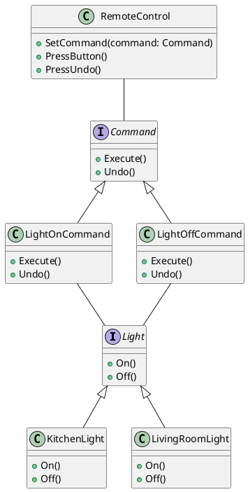

```plantuml
left to right direction
skinparam backgroundColor #F0F0F0

@startuml

interface Light {
  +On()
  +Off()
}

class KitchenLight {
  +On()
  +Off()
}

class LivingRoomLight {
  +On()
  +Off()
}

interface Command {
  +Execute()
  +Undo()
}

class LightOnCommand {
  +Execute()
  +Undo()
}

class LightOffCommand {
  +Execute()
  +Undo()
}

class RemoteControl {
  +SetCommand(command: Command)
  +PressButton()
  +PressUndo()
}

Light <|-- KitchenLight
Light <|-- LivingRoomLight

Command <|-- LightOnCommand
Command <|-- LightOffCommand

LightOnCommand -- Light
LightOffCommand -- Light

RemoteControl -- Command
```